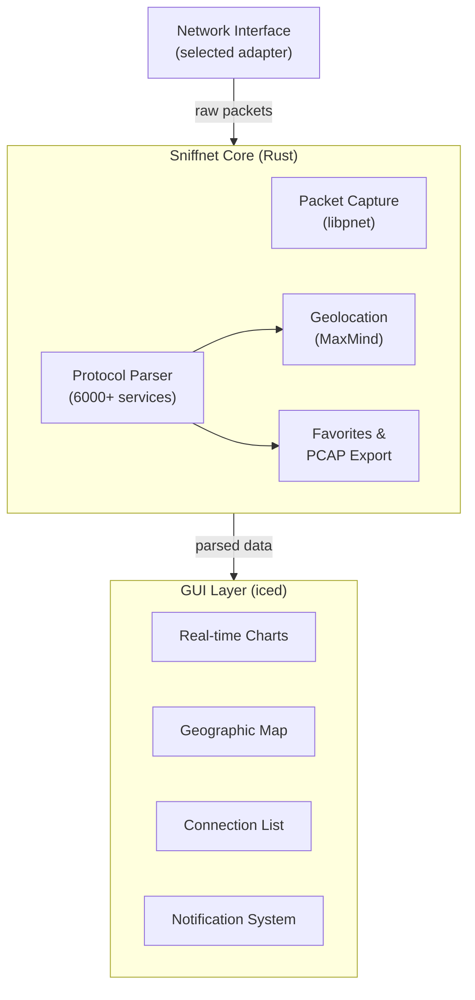

import Tabs from '@theme/Tabs';
import TabItem from '@theme/TabItem';

# Sniffnet

Sniffnet is an open-source network traffic monitoring tool written almost entirely in Rust. It originated as a university assignment at Politecnico di Torino, where developer Giuliano Bellini was asked to write a basic console script that logged network traffic to a file. He kept refining it in his free time — adding a GUI, geolocation, webhook alerts, and a PCAP import engine — until it became one of the most popular network tools on GitHub with over 40K stars.

The tool provides real-time visual inspection of network traffic, transforming dense packet data into interactive charts, auto-detected protocols, geographic origin maps, and anomalous bandwidth spike alerts. It is dual-licensed under Apache-2.0 and MIT.

## Key Features & Advantages

- **Rust-native performance**: Written primarily in Rust, leveraging memory safety and native concurrency for packet analysis without consuming excessive system resources.
- **Zero telemetry**: No ads, trackers, or paywalled features. Built around data sovereignty and privacy by design.
- **Real-time visualization**: Interactive charts showing traffic intensity, protocol distribution, and geographic origin of connections.
- **Protocol identification**: Detects 6000+ upper layer services, protocols, trojans, and worms.
- **PCAP import/export**: Import and export PCAP files for capture analysis and sharing.
- **Cross-platform**: Native builds for Windows (x64, arm64, x86), macOS (Intel, Apple Silicon), and Linux (AppImage, DEB, RPM).
- **IP geolocation**: MaxMind-powered geolocation and ASN data for remote hosts.
- **Custom notifications**: Set alerts for defined network events and import custom IP blacklists.
- **Thumbnail mode**: Keep monitoring network activity when the app is minimized.

:::info
Sniffnet supports 24 languages through a global community of contributors. The GUI is built with [iced](https://github.com/iced-rs/iced), a cross-platform GUI library for Rust.
:::

## Installation & Setup

Sniffnet provides pre-built binaries for all major platforms.

### Windows

Download the installer or portable archive from the [Releases page](https://github.com/GyulyVGC/sniffnet/releases). Free code signing for Windows is provided by [SignPath.io](https://signpath.io/).

### macOS

Download the `.dmg` file for either Intel or Apple Silicon from the [Releases page](https://github.com/GyulyVGC/sniffnet/releases).

### Linux

<Tabs groupId="linux-package">
  <TabItem value="appimage" label="AppImage">
    ```bash
    # Download and make executable
    chmod +x sniffnet_Linux_x86_64.AppImage
    ./sniffnet_Linux_x86_64.AppImage
    ```
  </TabItem>
  <TabItem value="deb" label="DEB (Debian/Ubuntu)">
    ```bash
    sudo dpkg -i sniffnet_Linux_amd64.deb
    ```
  </TabItem>
  <TabItem value="rpm" label="RPM (Fedora/RHEL)">
    ```bash
    sudo rpm -i sniffnet_Linux_amd64.rpm
    ```
  </TabItem>
</Tabs>

:::tip
If you experience rendering problems on Linux, set the `ICED_BACKEND` environment variable:
```bash
export ICED_BACKEND=tiny-skia
```
:::

## Usage

1. **Select a network adapter** to inspect from the main interface.
2. **Apply filters** to narrow observed traffic by protocol, IP, or port.
3. **View real-time charts** for traffic intensity and protocol distribution.
4. **Inspect connections** — click any connection to see domain name, ASN, geolocation, and the program generating traffic.
5. **Save favorites** — bookmark network hosts, services, and programs for quick access.

## Configuration

Sniffnet stores its configuration locally. You can customize:

- **Notification rules** for specific network events (e.g., connection to a known malicious IP).
- **IP blacklists** — import custom lists to flag dangerous connections.
- **Themes** — choose built-in styles or create custom themes.
- **PCAP capture paths** for automatic or manual traffic recording.

## Architecture



## Comparison: Sniffnet vs tcpdump vs Wireshark

| Feature | Sniffnet | tcpdump | Wireshark |
| :--- | :--- | :--- | :--- |
| **Interface** | GUI (iced) | CLI | GUI (Qt) |
| **Language/Performance** | Rust — native concurrency, low overhead | C — lightweight, minimal deps | C — feature-rich but heavier |
| **Primary Use Case** | Real-time traffic monitoring & visualization | Scripted packet captures, pipelines | Deep packet inspection & forensics |
| **Learning Curve** | Low — intuitive GUI | Medium — requires CLI/filter syntax | Medium-High — powerful but complex UI |
| **Protocol Identification** | 6000+ services, auto-detection | Manual decoding | Deep dissectors, plugin ecosystem |
| **PCAP Support** | Import/Export | Read/Write | Read/Write, merge, reassembly |
| **Extra Features** | Geolocation, thumbnails, custom themes, IP blacklists | Raw packet output, regex filters | Protocol dissectors, I/O graphs, conversation stats |
| **Cost/Licensing** | Free — Apache-2.0 + MIT | Free — BSD | Free — GPL-2.0 |

:::tip
Use **Sniffnet** for a quick, visual overview of live traffic with minimal setup. Use **tcpdump** for lightweight scripted captures. Use **Wireshark** when you need deep protocol dissection or forensic-level analysis.
:::

## References

- [GitHub Repository](https://github.com/GyulyVGC/sniffnet)
- [Official Website](https://sniffnet.net/)
- [iced GUI Library](https://github.com/iced-rs/iced)
- [MaxMind GeoIP](https://www.maxmind.com/)
- [SignPath.io — Free Code Signing](https://signpath.io/)
