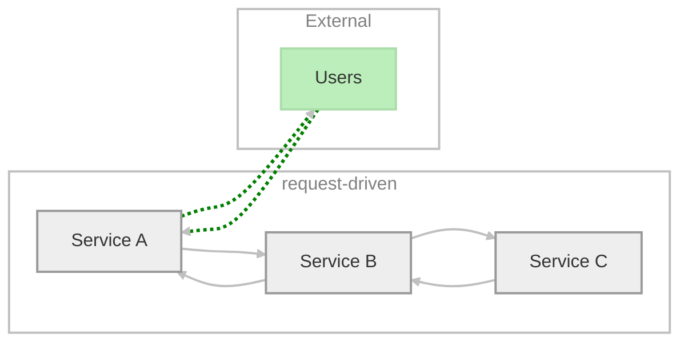
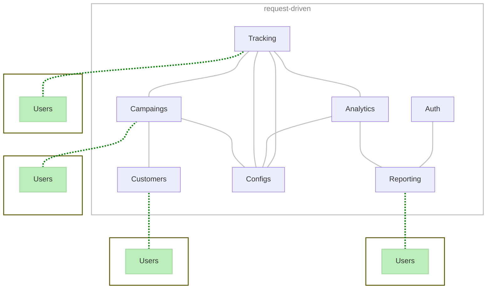
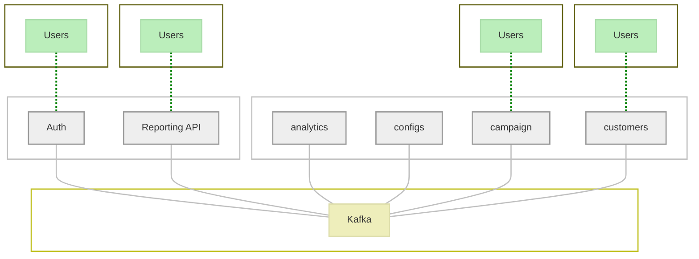

# Microservices

## Approach

Using a microservices approach to application development enables us to improve resilience and expedite our time to market.

It’s easier to develop, test, deploy, and most importantly, change and maintain our entire application stack when it’s broken up into little pieces.

That said, breaking an app into smaller units does not mean that everything works perfectly right away. Without the proper investigation we could just end with a distributed monolith. It’s important to implement microservices in a particular way. 

## Services coupled to each other

**Bad practice** for production large scale usage.

The “request-driven” architectures (e.g. REST) are the simplest and most common pattern of service communication (e.g. Service A asks for some information from Service B and waits. Service B then responds and sends the information to Service A).

Working with HTTP APIs is one of these basic things developers learn and commonly utilize. It’s clear when a request was received and acknowledged by the corresponding service, and there are plenty of tools to debug HTTP APIs. As such, it was our default go-to method to communicate between services across the system. The simplicity of the “request-driven” communication served us very well in moving fast, delivering new features, and growing our systems to accommodate all needs.

Unfortunately, this pattern means a tight coupling of services. 
  * In small systems it works perfectly fine
  * For microserviers with dozens or hunderds os services, this sort of coupling stops agility and blocks rapid scaling.

An illustration of microservices "request-driven" communication, Service A is dependent on B and C

#### Risks

* When using this pattern is that each "core" service (e.g. service C in the above illustration) becomes a single point of failure.
* Dependency chain gets disrupted (mega-disaster):
  * It can potentially create a performance bottleneck
  * It can potentionally create a downtime of the dependent services.
  * It might sound like it’s easy to work around, but every service being added to the chain requires:
    * A service discovery mechanism (or even a service mesh in big systems)
    * Failover/retries
    * Circuit breakers
    * Timeouts
    * Caching mechanisms in place - making it a great challenge to work flawlessly end-to-end.

In practice, using synchronous communications, like REST, across the entire system makes it behave like a monolith or more precisely a distributed monolith that prevents the full benefits of microservices from being enjoyed.

An illustration of overly chatty microservices (AKA spaghetti)

## Good practices

In order to untangle that mess, the idea is to move many core services to communicate using an asynchronous event-driven architecture.

Let the core service publish the information it provides whenever that information is updated, rather than waiting for another service to request that information.

By using "push" instead of "pull",  they system handles data in realtime. Now can dispose of many of the complex cache management and purging mechanisms, service discovery, and retries techniques used in the past in order to maintain the reliability and performance of the system while using synchronous services communication.

Services can now:
* Publish events to a resilient message broker asynchronously (Kafka in the example ). 
* Trust the broker to route the message to the right service, and the receiving parties subscribe to key events that interest them. 
* Easy to add subscribers and that way they don’t put a further load on the publisher service.

## References

* [2019: Are Your Microservices Overly Chatty?](https://thenewstack.io/are-your-microservices-overly-chatty/)

