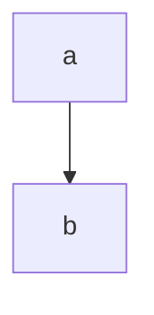
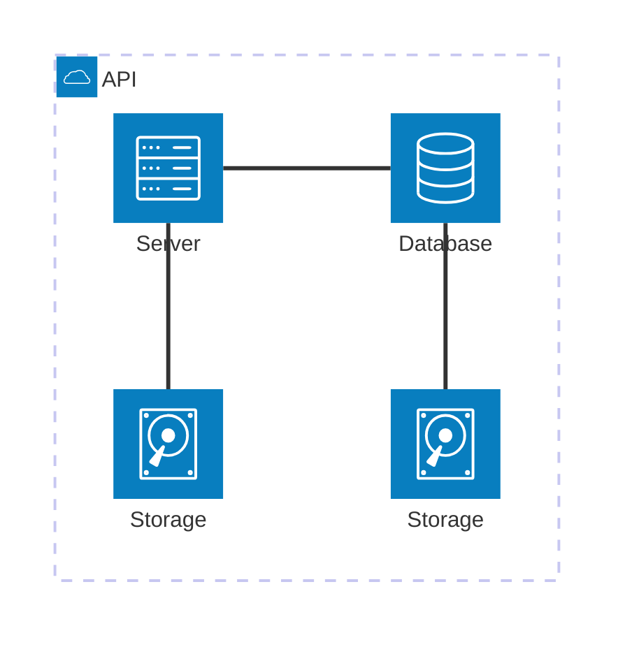

# Install mermaid.js

- [Docusaurus theme mermaid](https://docusaurus.io/docs/api/themes/@docusaurus/theme-mermaid#configuration)

## Docusaurus v3+

1. Install `yarn add @docusaurus/theme-mermaid`

2. Update config:

  ```js title="docusaurus.config.js"
  export default {
  themes: ['@docusaurus/theme-mermaid'],
  // In order for Mermaid code blocks in Markdown to work,
  // you also need to enable the Remark plugin with this option
  markdown: {
    mermaid: true,
    },
  };
  ```

## Docusaurus v2+

With the current version it's pretty straightforward to integrate:

1. Install `yarn add mdx-mermaid mermaid` or manually add following this steps:

2. Add  plugin to `docusaurus.config.js` at presets.remarkPlugins

```
docusaurus.config.js:          remarkPlugins: [math, require('mdx-mermaid')],
```


## Usage

### Simple diagram

- [Diagram Doc](https://mermaid.js.org/syntax/flowchart.html)

import Tabs from '@theme/Tabs';
import TabItem from '@theme/TabItem';

<Tabs>
  <TabItem value="render" label="Render" default>



  </TabItem>

  <TabItem value="code" label="Code" default>

```


  </TabItem>
</Tabs>

### Architecture

<Tabs>
  <TabItem value="render" label="Render" default>



  </TabItem>

  <TabItem value="code" label="Code" default>
```


  </TabItem>
</Tabs>


## VisualStudio Code

### Plugin

* [Mermaid Export](https://marketplace.visualstudio.com/items?itemName=Gruntfuggly.mermaid-export)
* [Mermaid Editor](https://marketplace.visualstudio.com/items?itemName=tomoyukim.vscode-mermaid-editor)

## References

* [https://github.com/facebook/docusaurus/issues/1258](https://github.com/facebook/docusaurus/issues/1258)
* [https://docusaurus.io/docs/markdown-features/plugins](https://docusaurus.io/docs/markdown-features/plugins)
* [https://jojozhuang.github.io/tutorial/mermaid-cheat-sheet/](https://jojozhuang.github.io/tutorial/mermaid-cheat-sheet/)
* [https://mermaid-js.github.io/mermaid/#/flowchart?id=styling-and-classes](https://mermaid-js.github.io/mermaid/#/flowchart?id=styling-and-classes)

## Issues

* [Arrow color not using styles](https://github.com/mermaid-js/mermaid/pull/2382)

