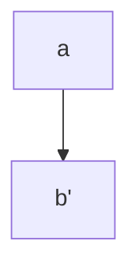

# Install mermaid.js

## Docousaurus v2+

With the current version it's pretty straightforward to integrate:

1. Install `yarn add mdx-mermaid mermaid` or manually add following this steps:

2. Add  plugin to `docusaurus.config.js` at presets.remarkPlugins

```
docusaurus.config.js:          remarkPlugins: [math, require('mdx-mermaid')],
```


## Usage

```js


## VisualStudio Code

### Plugin

* [Mermaid Export](https://marketplace.visualstudio.com/items?itemName=Gruntfuggly.mermaid-export)
* [Mermaid Editor](https://marketplace.visualstudio.com/items?itemName=tomoyukim.vscode-mermaid-editor)

## References

* <https://github.com/facebook/docusaurus/issues/1258>
* <https://docusaurus.io/docs/markdown-features/plugins>
* <https://jojozhuang.github.io/tutorial/mermaid-cheat-sheet/>
* <https://mermaid-js.github.io/mermaid/#/flowchart?id=styling-and-classes>

## Issues

* [Arrow color not using styles](https://github.com/mermaid-js/mermaid/pull/2382)

